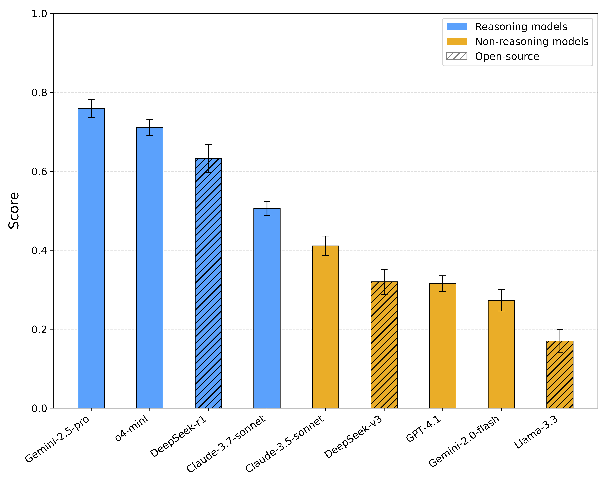
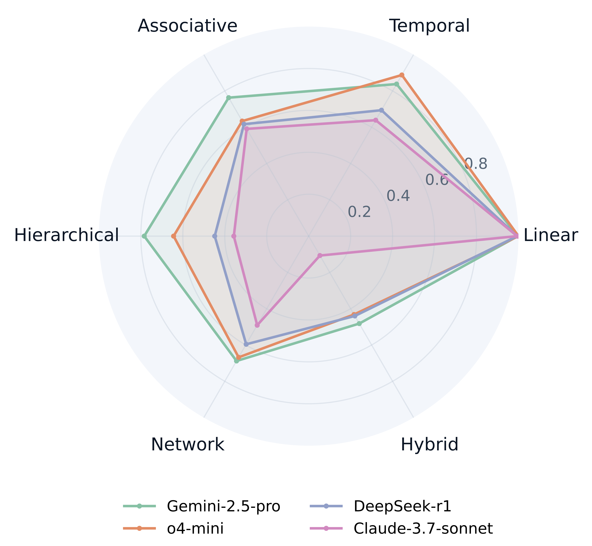

# DSR-Bench: Data Structure Reasoning Benchmark for LLMs

<p align="center">
  
  
</p>

<p align="center">
    <a href="https://huggingface.co/collections/vitercik-lab/dsr-bench-6826381f6297ff1499134163">💻 Dataset </a> 
</p>

## Table of Contents

- [Introduction](#introduction)
- [Installation Quickstart](#installation-quickstart)
- [Usage](#usage)
- [Data Structures and Suites](#data_structures_and_suites)
- [Evaluating New Models](#evaluating-new-models)

## Introduction

DSR-Bench is a benchmark for LLMs designed to test their structural reasoning ability: the ability to understand and manipulate 
data according to specific relationships such as order, hierarchy, and connectivity. It contains 6 categories of 20 
data structures, 30 operations, summing up to a total of 2700 questions. It has the following strengths: 

- **Hierarchical organization**: Tasks are organized by increasing structural complexity, enabling a fine-grained analysis of specific reasoning skills. Within each category, we design a range of tasks to isolate different sources of structural complexity, allowing structural reasoning to be broken down into progressively more challenging tasks. This approach precisely identifies the specific types of data relationships that pose difficulties for LLM reasoning.

- **Deterministic evaluation**: Each data structure task has a concise and well-defined correct final state, allowing for deterministic and unambiguous scoring. Unlike open-ended tasks, this design supports fully automated evaluation without the need for human or model-based judgment, resulting in a fairer and more objective evaluation pipeline. 

- **Low-contamination data**: All tasks are generated efficiently from synthetic distributions, significantly reducing contamination risks from pretraining data. This setup also enables large-scale evaluation with minimal human involvement.


## Installation Quickstart

### Environment

- Use `conda env create -f environment.yml` to generate a conda environment called `DSR-Bench`, or
- Create a Python virtual environment using
    ```bash
    python -m venv .venv
    source .venv/bin/activate
    ``` 
    and run `pip install -f requirements.txt` to install the environment required properly. 

### API Keys

In order to call models properly, you need to create an API key for each model's organization. After 
you have all your API keys, here's how you would need to specify your API key: 

First set your openai key `OEPNAI_API_KEY` (and openai organization `OPENAI_ORGANIZATION` optionally):
```
$env:OPENAI_API_KEY="your openai api key" # for Windows powershell
export OPENAI_API_KEY="your openai api key" # for Linux
export ANTHROPIC_API_KEY="your anthropic api key" 
export LLAMA_API_KEY="your llama api key"
export GEMINI_API_KEY="your gemini api key"
export DEEPSEEK_API_KEY="your deepseek api key"
export GOOGLE_PROJECT_ID="your google project id"
export GOOGLE_BUCKET_ID="your google bucket id"
```

**Note about local models**: In our evaluation pipeline, the evaluation for Llama models are implemented using 
[Ollama](https://ollama.com/). We pulled Llama models to our own GPU node for evaluation. We suggest users of 
DSR-Bench to check out the documentation of Ollama and make sure to have GPU available for faster inference on 
longer prompts if testing of Llama models is desired. 

## Usage 

### Submit Query
**Basic Usage**
Run the following command for evaluating data structure `type` and operation `operation`:
```
python -m evaluation.<type>.<operation> 
```

**Specification of flags available**
- `--model`: Name of LLM you wanted to test. 
- `--mode`: The task length category (short, medium, or long, short by default)
- `--prompt`: Prompting method (stepwise, 0-CoT, CoT, k-shot, none)
- `--T`: temperature of model used in evaluation
- `--token`: maximum output token model is allowed to use
- `--batch`: whether or not to used batch API (True or False), implemented for all OpenAI, Anthropic, and Gemini models
- `--dim`: dimension of data to evaluation (1, 2, 3, 5), only applicable to DSR-Bench-Spatial data structures

e.g.
```
python -m evaluation.array.access --model o4-mini --prompt CoT --mode short --token 1500 --batch True 
```

### Batch Evaluation Option

When setting `--batch True`, DSR-Bench will submit your request as a batch to the server. Batch requests will finish in 
the window of 24 hours, and is 50% less expensive compare to non-batched output. It is recommended when submitting a large amount of queries at the same time. 

We implemented fully automated pipeline for all OpenAI, Anthropic, and Gemini models that will help you submit the batch to server, wait till it's finished, and pull the results back to parse. When using batch API, it is recommended that you use methods like nohup to prevent interruption to the process and allow successful fetching (as wait time can 
be up to 24 hours). 

## Data Structures and Suites

### Category

DSR-Bench-main include 6 categories of data structures divided by the relational structure they represent. 


**Linear (Sequential):**
Linear relationships are the simplest forms of structured data, exemplified by structures such as arrays. Tasks in this category evaluate the ability to handle sequential access, index-based operations, and ordered insertions or deletions under strict positional constraints. 

**Temporal (Time-based ordering):**
Temporal reasoning is central to systems that depend on ordered execution over time, such as event queues and schedulers. Structures such as stacks, queues, priority queues, and skip lists operate under Last-In-First-Out (LIFO), First-In-First-Out (FIFO), priority, or probabilistic rules. The tasks designed for these structures test whether a model can simulate these ordered processes and maintain consistent state transitions.

**Associative (Key-value mapping):**
Associative structures, such as hashmaps, tries, and suffix trees, support efficient lookup and structured access in systems like databases. Tasks in this category probe the model’s ability to understand and manipulate mappings, perform key-based insertions and retrievals, and carry out pattern matching within nested or hashed structures.

**Hierarchical (Tree-like):**
Hierarchical data structures appear in contexts ranging from file systems to database indexing. We include binary search trees, heaps, red-black trees, and B+ trees in the benchmark. These tasks assess whether the model can maintain different structural properties, perform updates efficiently, and simulate recursive operations.

**Network (Connectivity and group membership):**
Graphs naturally capture many-to-many relationships, for example, in social networks where users interact with multiple others. In contrast, disjoint sets represent partitions and are useful for tracking group membership or connected components. Tasks in this category evaluate a model’s ability to reason about connectivity, perform graph traversals, and manage dynamic groupings via union-find or path compression. 

**Hybrid (Combined relationships):**
Real-world systems often employ hybrid data structures that combine multiple relational principles. This category includes LRU caches, integrating temporal and memory constraints; bloom filters, designed for probabilistic set membership queries; and Directed Acyclic Word Graphs, which are trie-like hierarchical graphs. These tasks assess whether a model can generalize beyond individual structural concepts and reason over combined constraints.


### Test DSR-Bench-spatial

DSR-Bench-spatial extends 3 data structures in DSR-Bench (K-D Heap, K-D Tree, Geometric Graphs) into variants in terms of dimensionality and data distribution. It contains the 1D, 2D, 3D, and 5D data versions of all three data structures, and 3 non-uniform data distributions (moons, circles, blobs) versions of K-D Tree, all containing short, medium, and long prompts, yielding a total of 450 questions.

This suite can easily be tested by adjusting the `--dim` flag for implemented data structures. 

### DSR-Bench-natural

DSR-Bench-natural extends 3 data structures in DSR-Bench (queue, binary search tree, and graphs) into narrative-based natural language questions. LLMs are no longer evaluated on textbook/interview question style formal prompts like “Given an empty queue. Do the following operations: (enqueue 2), (dequeue), (enqueue 3)... What is the current queue?”, but on a real-world scenario that implicit require the usage and maintenance of a data structure, like “On a sunny afternoon, an ice cream truck rolled into the park. Each children take their place at the end of the line while the vendor serves from the front. Leila Choi ran over and joined the line. The next kid is being served… What is the order of the remaining kids in line?”

This suite can easily be tested through calling the `natural` module. For example, 

```
python -m natural.queue.evaluation
```

This suite allows us to examine whether LLMs can generalize structural reasoning beyond formal task descriptions with real-world scenarios, which is a critical ability for LLM deployment as assistants for practical applications and highlights an important future research direction. It also tests LLMs' capacity to reason with ambiguity and confounding information, which we specifically designed and included in the questions (e.g., “A and B both saw the ice cream truck. Only A joined the line because B has no money”, where B here is the confounding name). 


## Evaluating New Models

The current pipeline should already be set up to automate evaluation of new models from the OpenAI, Claude, Gemini, and DeepSeek families, as well as any open-sourced models that Ollama can run. If persistent issue remains, it would be helpful to look into `evaluation/eval.py` and check out whether modifications need to be make about client definition. 
